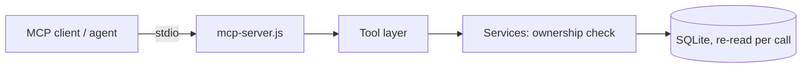

# MCP

`backend/mcp-server.js` is a Model Context Protocol server (stdio, newline-delimited JSON-RPC 2.0: `initialize`, `tools/list`, `tools/call`, `ping`). It was written against the protocol directly (no SDK could be installed) and tested with the project's own client, not a third-party one.

**Why:** agents get only structured, case-scoped tools, never database access. Every call runs as the user in the token, is validated, ownership-checked, and returns structured errors without stack traces.

**Start:** get a token with `POST /api/auth/mcp-token` (signed-in user), then  
`NS_MCP_TOKEN=<token> DATA_DIR=<server data dir> node backend/mcp-server.js`. It exits with code 2 if the token is missing, expired, or not MCP-scoped.

| Tool | Input | Returns |
|---|---|---|
| `get_case_material` | `case_id` | documents (id, name, type) |
| `get_claims` | `case_id` | claims with source location; `confidence` = extraction certainty only |
| `get_evidence` | `claim_id` (+`case_id`) | linked evidence with relationship and reason |
| `search_authorities` | `query`, `limit?` | ranked passages from the caller's own library; `relevance_score` is a ranking signal |
| `get_authority_excerpt` | `authority_id`, `passage_index?` | source text from the library |
| `find_claim_conflicts` | `case_id`, `claim_id` | potential conflicts; never says which source is right |
| `get_audit_history` | `case_id` | audit events |

Errors: `{ "error": { "code": "CASE_NOT_FOUND", "message": "…" } }` with `isError: true`. The stdio server does not persist its own call log.

**Demo:** `cd backend && npm run demo` starts a throw-away server, loads clearly labelled synthetic test data, and runs the seven tools through the real MCP server.
